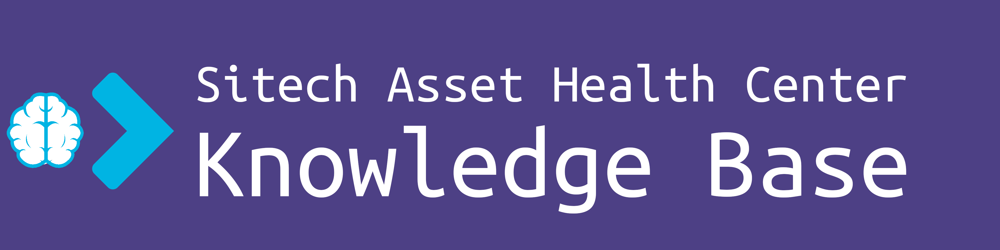

# How to connect to the IoT hub using the Node.js stack
Node.js is powerful code-stack developed around web-services, particularly focussing on client-server communication, 
supporting async, wait and multi-threading out-of-the-box. At Sitech we found that customers can struggle with the fast 
amount of documentation that can be found on the internet for connecting to the Azure IoT hub. In order to make it more 
concrete, we provide concrete code examples that fit the payload format that we use within our platform. In the bottom 
section we provide the source materials that we used to make these code samples.
## Payload
The payload that we expect to receive is based on a simple JSON structure, that contains the name, timestamp and actual
value. We also ask our customers to use a specific denominator for the individual plants. A conceptual JSON would look 
like this:

```
{
    'plant':'kewl_plant', 
    'tag':'the_perfect_sensor', 
    'timestamp':1611774590, 
    'value':5.6895
}
```
Note how the timestamp is a UNIX timestamp! Assuming UTF-8 standard, the decimal space is also denoted with a period ```.```
instead of with a comma ```,```

## How does it work under the hood
You get a specific connection string for us that you can embedded in the environment in which this code runs. With
this connection string you can call on the IoT Hub and get a SAS key, that enables you to send dat for 1 hour. After
the 1 hour you need to request a new SAS key. The libraries provided by Azure do this automatically however, so you only
need to worry about embedding the connection-string into your execution environment.

## How to install/manage Modules (other languages refer to it as Headers, Packages or Libraries) with Node.js
You might be novice with Node.js and want to understand how to set up everything. For local testing and debugging you
want to install Node, NVM and NPM. Node is the actual stack, NVM stands for Node Version Manager and NPM stands for Node
Package Manager. Using Linux has its benefits here, as its very interoperable when using the terminal. We personally use
Azure as our cloud provider. Please note that there are many debugging and testing environments and IDE integration 
available. For Azure the azure-function core-tools together with VS code and Azure extension can be a great platform to
create, test and debug serverless applications.

When setting up the webservice, most likely you are working in some containerized environment, likely in the cloud. Please
consider that Node.js provide great Docker support, please check their repo here: https://hub.docker.com/_/node. If you 
are working in a serverless container technology like the steps should be somewhat the same. On a high level you need to:
- Create a script 
- Define your environment in package.json
- Make sure that your dependencies are actually installed

To answer the question: if you use certain modules, these need to be defined in the package.json. An example is below:
```
{
  "name": "nodejs",
  "version": "1.0.0",
  "dependencies": {
      "my_dep": "^1.0.0",
      "another_dep": "~2.2.0"
    },
  "description": "",
  "main": "index.js",
  "scripts": {
    "test": "echo \"Error: no test specified\" && exit 1"
  },
  "keywords": [],
  "author": "",
  "license": "ISC"
}

```
For a full outline of all the options, please check out: https://docs.npmjs.com/creating-a-package-json-file. Please note
that the package.json defines 2 major aspects of your runtime. On the one hand it defines the dependencies, but it also 
defines the main script that will be kicked-off when running the Node.js application. In this case the file ```index.js```
in the root directory will be used to do *stuff*. 

The second step is actually installing the dependencies. On your local machine one would simply run 
```npm install kewl_package```. Containerized applications in e.g. Docker can be a little more difficult. Entering the 
bash through ```docker exec your_node_js_container bash``` should be enough to get you inside the container and enable 
you to run npm accordingly. From an orchestration point of view it is usually preferable to install the dependencies whilst
deploying. In that case a Dockerfile would be more helpfull. An example is given below:
```
FROM node:12.18.1
ENV NODE_ENV=production

WORKDIR /app

COPY ["package.json", "package-lock.json*", "./"]

RUN npm install --production

COPY . .

CMD [ "node", "server.js" ]
```
Notice how npm can be initialized by using ```npm install --production```. Any other containerization solution might have
different approaches, but will all be based around the same principle of deploying a configuration JSON in the format of
package.json, that can initialize npm to install all modules that might be needed for your application. Keep in mind that
some Cloud vendors enable you to script within the browser. It can be tricky to install dependencies in this 'ad-hoc' 
approach. In Azure, Azure Functions can fundamentally build as webservices. This means that also the backend is approachable
within browser. In Azure this feature is called Kudus, and can be found when going to the advanced options of the serverless
function. Once there, its again just a matter of ```npm install whatever_you_need```.

## Script example
The script example that can be found in the root of this file, is an annotated version of the code that is provided in the
manual of NPM regarding the Azure Iot Device HTTP module. We also templated a potential payload into the code. The code 
can both be a single JSON object or an array or JSON objects respectively. 
```
{
    'plant':'kewl_plant', 
    'tag':'the_perfect_sensor', 
    'timestamp':1611774590, 
    'value':5.6895
}
```
Or as an array
```
[
    {
        'plant':'kewl_plant', 
        'tag':'the_perfect_sensor', 
        'timestamp':1611774590, 
        'value':5.6895
    },
    {
        'plant':'kewl_plant', 
        'tag':'another_sensor', 
        'timestamp':1611774590, 
        'value':4.34830
    }
]
```

## Source Materials
The Azure IoT overal support and SDK page: https://docs.microsoft.com/en-us/azure/iot-hub/iot-hub-device-sdk-platform-support

The Azure IoT SDK for the Node.js code-stack be found here: https://github.com/Azure/azure-iot-sdk-node

If you just want to look at the HTTP library, you can find the documentation at: 
https://www.npmjs.com/package/azure-iot-device-http 